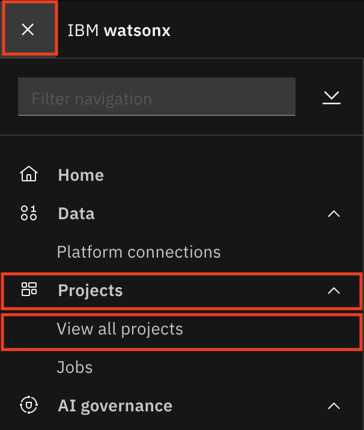
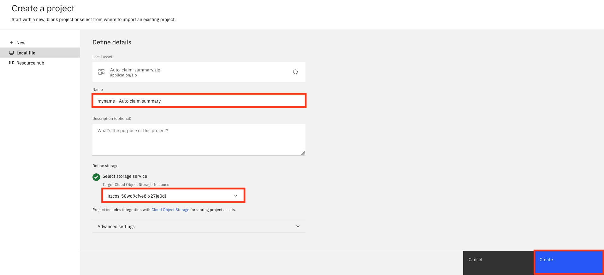
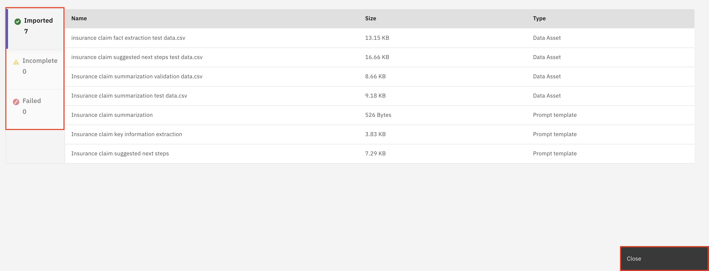
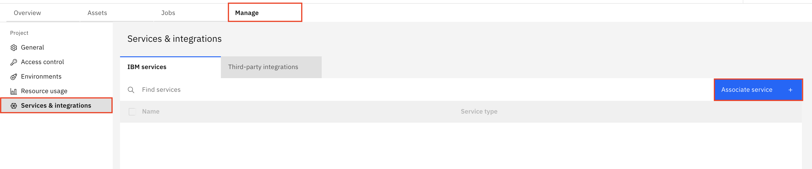
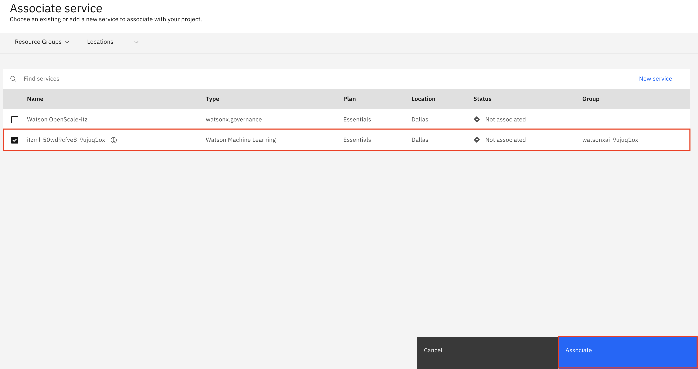
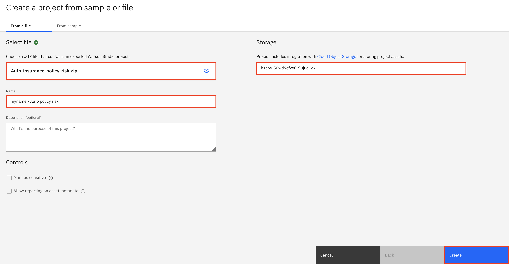

# Crear un proyecto IBM watsonx.ai

### Crear un proyecto IBM watsonx.ai

*   Para saber cómo configurar un [proyecto IBM watsonx.ai con un modelo de IA **generativa**](#set-up-an-ibm-watsonxai-project-with-a-generative-ai-model), continúe en [Configurar un proyecto IBM watsonx.ai con un modelo de IA **generativa**](#set-up-an-ibm-watsonxai-project-with-a-generative-ai-model)
*   Para saber cómo configurar un [proyecto IBM watsonx.ai con un modelo de IA **predictiva**](#set-up-an-ibm-watsonxai-project-with-a-predictive-ai-model), continúe en [Configurar un proyecto IBM watsonx.ai con un modelo de IA **predictiva**](#set-up-an-ibm-watsonxai-project-with-a-predictive-ai-model)

## Configurar un proyecto IBM watsonx.ai con un modelo **generativo** de IA

En este laboratorio, crearás un proyecto IBM watsonx.ai que contendrá todos los activos utilizados para desplegar y trabajar con un modelo de IA **generativa** que estarás gobernando.

### Crear el proyecto

1.  Descargue el archivo de proyecto [Auto-claim-summary.zip](https://raw.githubusercontent.com/ibm-build-lab/VAD-VAR-Workshop/main/content/Watsonx/WatsonxGov/files/Auto-claim-summary.zip) a su máquina local.
2.  En la plataforma IBM watsonx, haga clic en el **Menú de navegación** de la parte superior izquierda para expandirlo. Localice la sección **Proyectos** del menú, ampliándola si es necesario, y haga clic en **Ver todos los proyectos**.

3.  Haga clic en el botón azul **Nuevo proyecto** de la derecha y, a continuación, seleccione el mosaico **Crear un proyecto a partir de una muestra o un archivo**.
4.  En la ventana **Crear un proyecto a partir de una muestra o un archivo**, rellene los datos que se indican a continuación y pulse el botón **Crear**:

*   **Cargue el archivo:** Busque el archivo de proyecto **Auto-claim-summary.zip** que descargó en el primer paso y cárguelo.
*   **Nombre:** Dé a su proyecto un nombre que incluya alguna información identificativa y el propósito para el que se utilizará (ej. `<your initials or unique string> - Auto claim summary`).
*   **Seleccione el servicio de almacenamiento:** Selecciona una instancia de Cloud Object Storage para guardar los datos de tu proyecto.

Has creado correctamente un proyecto IBM watsonx.ai.

### Verificar y configurar el proyecto

Al importar un proyecto desde un archivo, es fundamental asegurarse de que todos los recursos se importan correctamente, ya que la herramienta de proyectos informará de que la creación se ha realizado correctamente aunque uno o más recursos no se hayan importado.

1.  Una vez que el proyecto se haya creado correctamente, haga clic en el botón **Ver resumen de la importación** y asegúrese de que no aparece nada en las categorías **Incompleto** o **Fallido** a la izquierda de la pantalla. Una vez que el proyecto se haya importado y verificado correctamente, haga clic en el botón **Cerrar** para acceder al proyecto recién creado.

2.  Haga clic en la pestaña **Gestionar**. En la pestaña **Gestionar**, haga clic en el elemento **Servicios e integraciones** del menú de la izquierda y, a continuación, haga clic en el botón azul **Asociar servicio** de la derecha. Aparecerá una lista de servicios en una tabla.

3.  Localice en la tabla el **servicio** de aprendizaje automático apropiado para la cuenta. En la columna **Tipo** debe aparecer Aprendizaje automático **de Watson**. Marque la casilla situada a la izquierda del servicio y, a continuación, haga clic en el **botón** azul **Asociar**.

Ha configurado correctamente el proyecto y ya está listo para ser utilizado.

### Enhorabuena, has llegado al final del laboratorio 103 para configurar un proyecto IBM watsonx.ai con un modelo de IA **generativa**.

Haga clic en, **[laboratorio 104](/watsonx/watsonxgov/104)** para iniciar el siguiente laboratorio.

## Configurar un proyecto IBM watsonx.ai con un modelo de IA **predictiva**

En este laboratorio, crearás un proyecto IBM watsonx.ai que contendrá todos los activos utilizados para desplegar y trabajar con un modelo de IA **predictiva** que estarás gobernando.

### Crear el proyecto

1.  Descargue el archivo de proyecto [Auto-insurance-policy-risk.zip](https://raw.githubusercontent.com/ibm-build-lab/VAD-VAR-Workshop/main/content/Watsonx/WatsonxGov/files/Auto-insurance-policy-risk.zip) a su máquina local.
2.  En la plataforma IBM watsonx, haga clic en el **Menú de navegación** de la parte superior izquierda para expandirlo. Localice la sección **Proyectos** del menú, ampliándola si es necesario, y haga clic en **Ver todos los proyectos**.

3.  Haga clic en el botón azul **Nuevo proyecto** de la derecha y, a continuación, seleccione el mosaico **Crear un proyecto a partir de una muestra o un archivo**.
4.  En la ventana **Crear un proyecto a partir de una muestra o un archivo**, rellene los datos que se indican a continuación y pulse el botón **Crear**:

*   **Cargue el archivo:** Busque el archivo de proyecto **Auto-insurance-policy-risk.zip** que descargó en el primer paso y cárguelo.
*   **Nombre:** Dé a su proyecto un nombre que incluya alguna información identificativa y el propósito para el que se utilizará (ej. `<your initials or unique string> - Auto policy risk`).
*   **Seleccione el servicio de almacenamiento:** Selecciona una instancia de Cloud Object Storage para guardar los datos de tu proyecto.

Has creado correctamente un proyecto IBM watsonx.ai.

### Verificar y configurar el proyecto

Al importar un proyecto desde un archivo, es fundamental asegurarse de que todos los recursos se importan correctamente, ya que la herramienta de proyectos informará de que la creación se ha realizado correctamente aunque uno o más recursos no se hayan importado.

1.  Una vez que el proyecto se haya creado correctamente, haga clic en el botón **Ver resumen de la importación** y asegúrese de que no aparece nada en las categorías **Incompleto** o **Fallido** a la izquierda de la pantalla. Una vez que el proyecto se haya importado y verificado correctamente, haga clic en el botón **Cerrar** para acceder al proyecto recién creado.

2.  Haga clic en la pestaña **Gestionar**. En la pestaña **Gestionar**, haga clic en el elemento **Servicios e integraciones** del menú de la izquierda y, a continuación, haga clic en el botón azul **Asociar servicio** de la derecha. Aparecerá una lista de servicios en una tabla.

3.  Localice en la tabla el **servicio** de aprendizaje automático apropiado para la cuenta. En la columna **Tipo** debe aparecer Aprendizaje automático **de Watson**. Marque la casilla situada a la izquierda del servicio y, a continuación, haga clic en el **botón** azul **Asociar**.

Ha configurado correctamente el proyecto y ya está listo para ser utilizado.

### Enhorabuena, has llegado al final del laboratorio 103 para configurar un proyecto IBM watsonx.ai con un modelo de IA **predictiva**.

Haga clic en, **[laboratorio 104](/watsonx/watsonxgov/104)** para iniciar el siguiente laboratorio.
