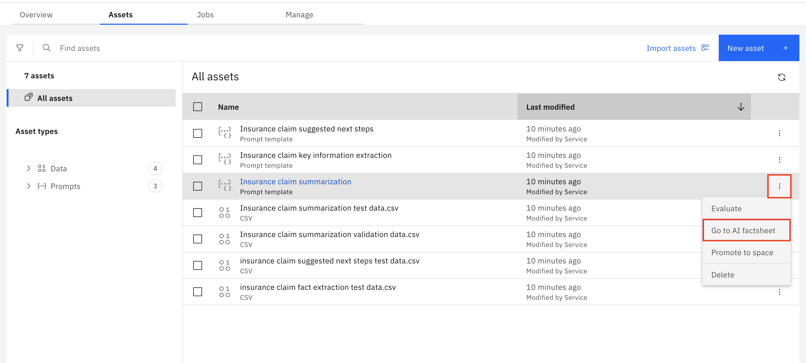
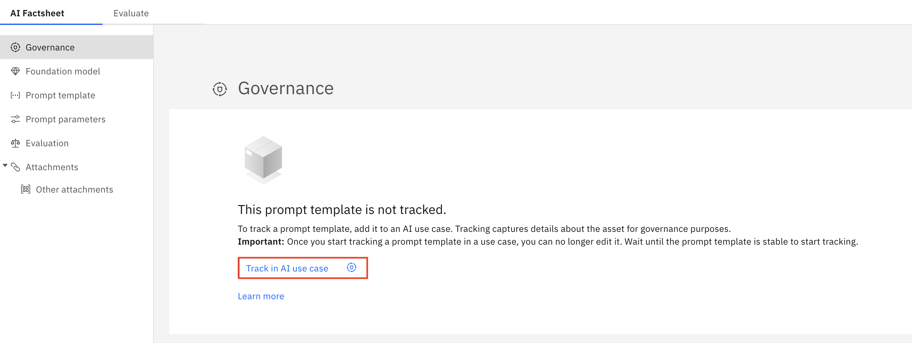
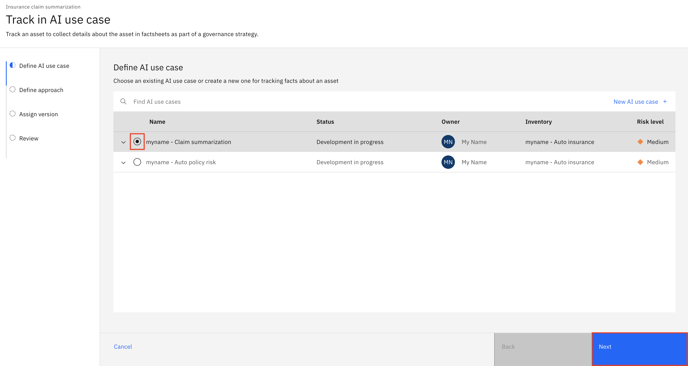
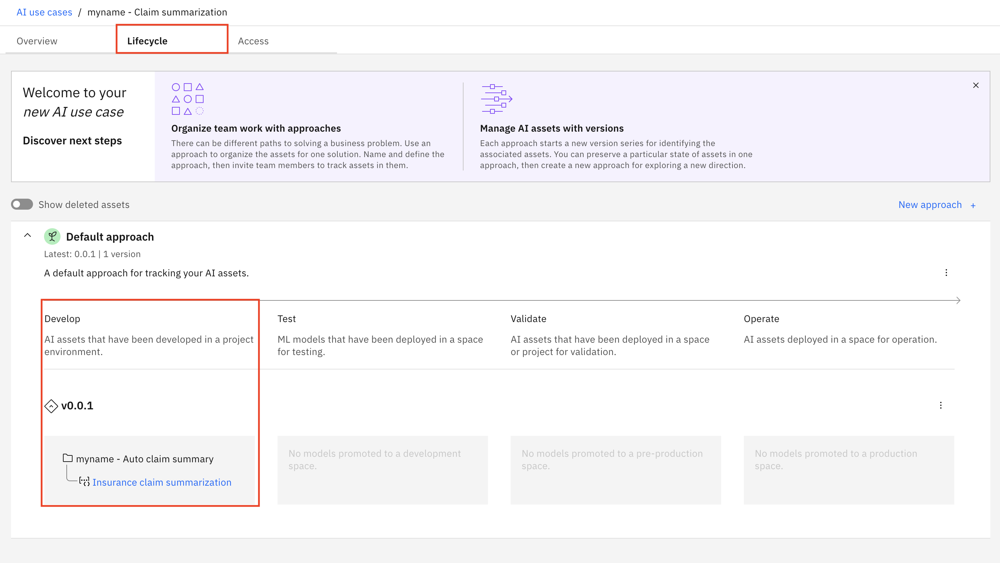
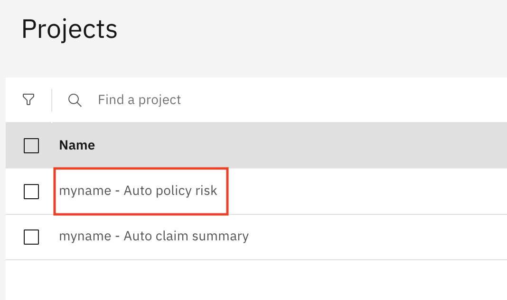
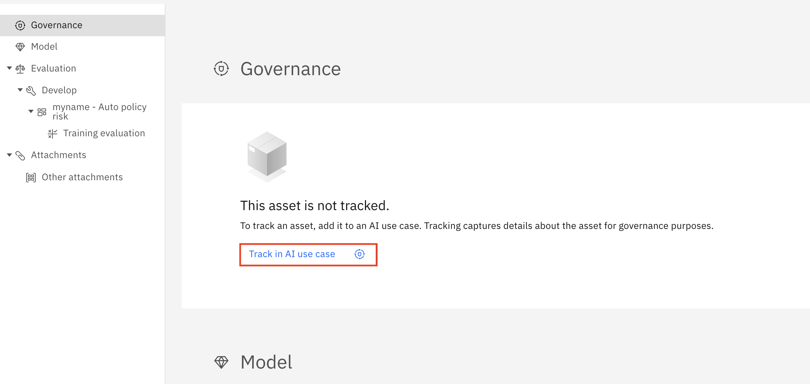
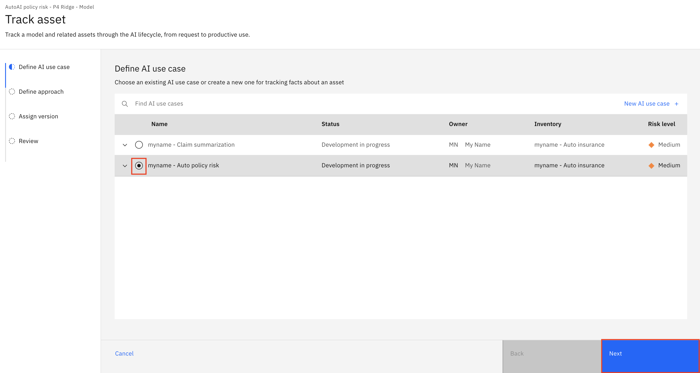
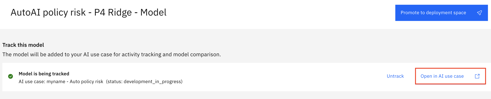
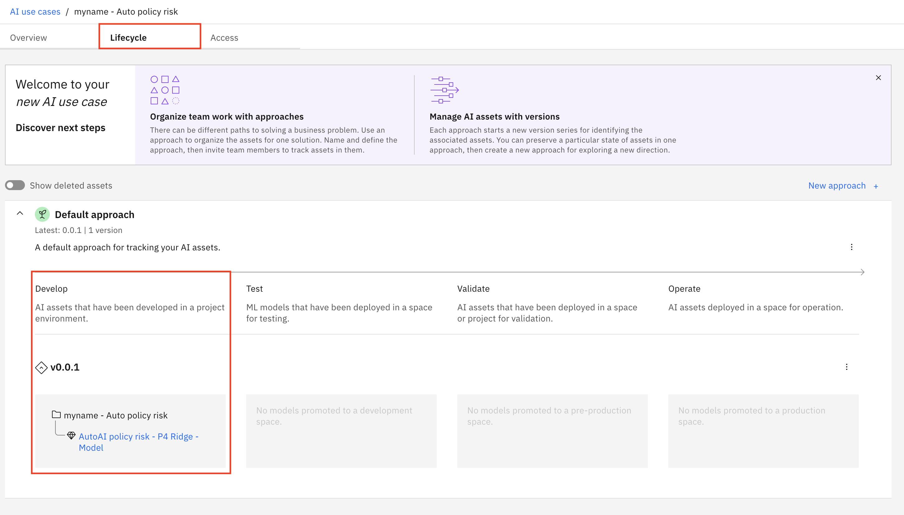

<QuizAlert text="¡Aviso! ¡El material del cuestionario se marcará así!" />

# Seguimiento de un modelo de IA

### Seguimiento de un modelo de IA

*   Para saber cómo realizar el seguimiento de un modelo de [IA **generativa**](#track-a-generative-ai-model), continúe en [Seguimiento de un modelo de IA **generativa**](#track-a-generative-ai-model)
*   Para saber cómo realizar el seguimiento de un modelo de [IA **predictiva**](#track-a-predictive-ai-model), continúe en [Seguimiento de un modelo de IA **predictiva**](#track-a-predictive-ai-model)

## Seguimiento de un modelo **generativo** de IA

En este laboratorio, configurará el seguimiento de modelos para gobernar un modelo **generativo** de IA entrenado para resumir reclamaciones de seguros.

### Configurar el seguimiento de modelos

1.  En la plataforma IBM watsonx, haga clic en el **Menú de navegación** de la parte superior izquierda para expandirlo. Localice la sección **Proyectos** del menú, ampliándola si es necesario, y haga clic en **Ver todos los proyectos**.

2.  Seleccione el proyecto de IA **generativa** que creó en **el laboratorio 103** (por ejemplo, `<your initials or unique string> - Auto claim summary`).

3.  Haga clic en la pestaña **Activos** del proyecto. En la lista de activos, localice la entrada **Resumen de siniestros de seguros** y haga clic en los tres puntos de la derecha para desplegar el menú contextual. Haga clic en **Ver hoja de datos** AI en el menú.

4.  En la sección **"Gobernanza"** de la **ficha sobre IA**, haga clic en el botón " **Seguimiento de la IA** ".

5.  Haga clic en el botón de opción situado a la izquierda del caso de uso de IA que creó en **el laboratorio 102** (por ejemplo, `<your initials or unique string> - Claim summarization`). Haga clic en **Siguiente**.

6.  Cuando se le pida que **defina el enfoque**, deje seleccionado **Enfoque por defecto** y haga clic en **Siguiente**. Cuando se le pida que asigne una versión al modelo, seleccione **Experimental** y haga clic en **Siguiente**. Tenga en cuenta que aquí puede asignar manualmente un número de versión, o elegir un número de versión más apto para producción en función del estado del modelo. Haga clic en **Seguimiento de activos** para iniciar el seguimiento del modelo.
7.  Tenga en cuenta que la sección **Gobernanza** de la **ficha de datos de IA** contiene ahora información sobre el caso de uso de IA asociado, el enfoque utilizado, la versión del modelo y la fase del ciclo de vida**(Desarrollo**).

Ha configurado correctamente el seguimiento de modelos para un modelo de IA **generativa**.

### Ver el caso de uso de IA actualizado con el modelo rastreado

1.  En la esquina superior derecha de la sección **Gobernanza** de la **ficha de datos** de IA, haga clic en la flecha **Ver detalles** para acceder al caso de uso de IA asociado.

2.  Haga clic en la pestaña Ciclo de **vida** y, a continuación, desplácese hasta el mapa de modelos de la sección **Enfoque por defecto**. Observe que se enumeran cuatro secciones del ciclo de vida**(**Desarrollar, **Probar**, **Validar** y **Operar**). El modelo rastreado aún no ha sido promovido a un espacio de despliegue, por lo que aparece en la sección **Desarrollar** del ciclo de vida.

> **Nota:** la pestaña **Ciclo de vida** del **caso de uso de IA** es útil para que las partes interesadas y los usuarios empresariales obtengan una visión general rápida de todos los modelos que intentan abordar un problema concreto, con la posibilidad de profundizar para obtener más información según sea necesario, todo ello sin necesidad de acceder al proyecto en el que trabajan los desarrolladores y los ingenieros de datos.

Ha activado correctamente el seguimiento del modelo y ahora puede observar los cambios a medida que el modelo atraviesa el ciclo de vida.

### Enhorabuena, has llegado al final del laboratorio 104 para el seguimiento de un modelo de IA **generativa**.

Haga clic en, **[laboratorio 105](/watsonx/watsonxgov/105)** para iniciar el siguiente laboratorio.

## Seguimiento de un modelo **predictivo** de IA

En este laboratorio, configurará el seguimiento de modelos para gobernar un modelo **predictivo** de IA entrenado para evaluar el riesgo asociado a las pólizas de seguros de automóviles.

### Configurar el seguimiento de modelos

1.  En la plataforma IBM watsonx, haga clic en el **Menú de navegación** de la parte superior izquierda para expandirlo. Localice la sección **Proyectos** del menú, ampliándola si es necesario, y haga clic en **Ver todos los proyectos**.

2.  Seleccione el proyecto de IA **predictiva** que creó en **el laboratorio 103** (por ejemplo, `<your initials or unique string> - Auto policy risk`).

3.  Haga clic en la pestaña **Activos** del proyecto. En la lista de activos, localice y haga clic en la entrada **AutoAI policy risk - P4 Ridge - Model** para abrir la pantalla de información del modelo.

4.  En la sección **Seguimiento** de este modelo de la pantalla de información del modelo, haz clic en el botón **Seguimiento de este modelo**.

5.  Haga clic en el botón de opción situado a la izquierda del caso de uso de IA que creó en **el laboratorio 102** (por ejemplo, `<your initials or unique string> - Auto policy risk`). Haga clic en **Siguiente**.

6.  Cuando se le pida que **defina el enfoque**, deje seleccionado **Enfoque por defecto** y haga clic en **Siguiente**. Cuando se le pida que asigne una versión al modelo, seleccione **Experimental** y haga clic en **Siguiente**. Tenga en cuenta que aquí puede asignar manualmente un número de versión, o elegir un número de versión más apto para producción en función del estado del modelo. Haga clic en **Seguimiento de activos** para iniciar el seguimiento del modelo.

Ha configurado correctamente el seguimiento de modelos para un modelo de IA **predictiva**.

### Ver el caso de uso de IA actualizado con el modelo rastreado

1.  En la sección **Seguimiento de este modelo** de la pantalla de información del modelo, haga clic en el botón **Abrir en caso de uso AI**.

2.  Haga clic en la pestaña Ciclo de **vida** y, a continuación, desplácese hasta el mapa de modelos de la sección **Enfoque por defecto**. Observe que se enumeran cuatro secciones del ciclo de vida**(**Desarrollar, **Probar**, **Validar** y **Operar**). El modelo rastreado aún no ha sido promovido a un espacio de despliegue, por lo que aparece en la sección **Desarrollar** del ciclo de vida.

<QuizAlert text="Hay una pregunta de prueba sobre el ciclo de vida del model" />

> **Nota:** la pestaña **Ciclo de vida** del **caso de uso de IA** es útil para que las partes interesadas y los usuarios empresariales obtengan una visión general rápida de todos los modelos que intentan abordar un problema concreto, con la posibilidad de profundizar para obtener más información según sea necesario, todo ello sin necesidad de acceder al proyecto en el que trabajan los desarrolladores y los ingenieros de datos.

Ha activado correctamente el seguimiento del modelo y ahora puede observar los cambios a medida que el modelo atraviesa el ciclo de vida.

### Enhorabuena, has llegado al final del laboratorio 104 para el seguimiento de un modelo de IA **predictiva**.

Haga clic en, **[laboratorio 105](/watsonx/watsonxgov/105)** para iniciar el siguiente laboratorio.
