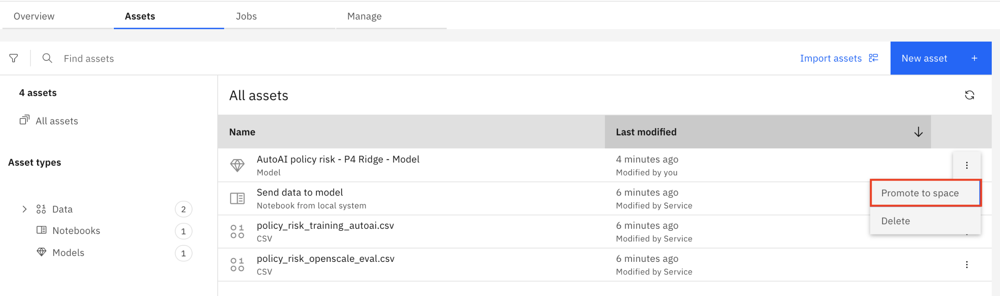

# Desplegar un modelo de IA

### Desplegar un modelo de IA

*   Para saber cómo desplegar un modelo de **IA generativa**, continúe en [Desplegar un modelo de IA **generativa**](#desplegar-un-modelo-de-ia-generativa)
*   Para saber cómo desplegar un modelo de **IA predictiva**, continúe en [Desplegar un modelo de IA **predictiva**](#desplegar-un-modelo-de-ia-predictiva)

## Desplegar un modelo de IA **generativa**

En este laboratorio, promoverá un modelo de IA **generativa** a un espacio de despliegue y lo desplegará. Watsonx utiliza espacios de despliegue para organizar modelos y activos relacionados con modelos para su validación y acceso en producción. El despliegue del modelo permite acceder a él a través de la API REST para realizar más pruebas.

### Crear un espacio de despliegue

1.  En la plataforma IBM watsonx, haga clic en el **menú de navegación** de la parte superior izquierda para expandirlo. Localice y haga clic en **Despliegues**.

2.  Haga clic en el botón **Nuevo espacio de despliegue**.
3.  En la ventana **Crear un espacio de despliegue**, rellene los datos siguientes y pulse el botón **Crear**:

*   **Nombre:** Dé a su espacio de despliegue un nombre que incluya alguna información identificativa, el propósito para el que se utilizará e incluya "testing" para denotar que se trata de un espacio para pruebas (ej. `<tus iniciales o cadena única> - Claim summary testing`).
*   **Descripción:** `Test the candidate claim summary model`
*   **Etapa de despliegue:** En el desplegable, haz clic en **Pruebas** de la lista. Designar la etapa de despliegue garantizará que los modelos desplegados en este espacio aparezcan en la fase correcta del mapa del ciclo de vida en el caso de uso de IA.
*   **Seleccione el servicio de almacenamiento:** Asegúrese de que el menú desplegable Seleccionar servicio de **almacenamiento** está correctamente configurado en el servicio de almacenamiento de objetos que está utilizando para este laboratorio.
*   **Seleccione el servicio de aprendizaje automático:** Asegúrese de que el menú desplegable Seleccionar servicio de aprendizaje **automático** está correctamente configurado en el servicio de aprendizaje automático que está utilizando para este laboratorio.

4.  Una vez creado el espacio, haga clic en **Cerrar** para volver a la lista de espacios.

Ha creado correctamente un espacio de despliegue.

### Promocionar el modelo en el espacio

1.  En la plataforma IBM watsonx, haga clic en el **Menú de navegación** de la parte superior izquierda para expandirlo. Localice la sección **Proyectos** del menú, ampliándola si es necesario, y haga clic en **Ver todos los proyectos**.

2.  Seleccione el proyecto de IA **generativa** que creó en **el laboratorio 103** (por ejemplo, `<tus iniciales o cadena única> - Auto claim summary`).

3.  Haga clic en la pestaña **Activos** del proyecto. En la lista de activos, localice la entrada **Resumen de siniestros de seguros** y haga clic en los tres puntos de la derecha para desplegar el menú contextual. Haga clic en **Promover al espacio** en el menú.

4.  Haga clic en el menú desplegable **Espacio de destino** y haga clic en el espacio que creó en el paso anterior. Marque la casilla a la izquierda de **Ir al espacio después de promover la plantilla de solicitud**. Haga clic en el botón **Promover**.

Ha promovido con éxito el modelo de IA **generativa** al espacio de despliegue.

### Crear un despliegue

El modelo se ha promocionado al espacio, pero los desarrolladores de aplicaciones no pueden acceder a él hasta que se haya desplegado. Los espacios de despliegue pueden contener diferentes tipos de activos, incluidos los propios modelos, así como los datos utilizados en los trabajos de procesamiento por lotes. Los espacios también están totalmente gobernados, lo que permite a los administradores proporcionar diferentes niveles de acceso a las distintas partes interesadas.

1.  Haga clic en el botón **Nuevo despliegue**.
2.  Dé a su modelo desplegado un nombre que incluya alguna información identificativa y el propósito para el que se utilizará (ej. `<tus iniciales o cadena única> - Claim summarization`). Haga clic en el botón **Crear**.

Una vez finalizado el despliegue, el **Estado** en la tabla mostrada cambiará a **Desplegado**.

Ha creado correctamente un despliegue.

### Ver los detalles de el despliegue y los cambios en el ciclo de vida

1.  Haga clic en el nuevo despliegue de la lista de despliegues.

Tenga en cuenta que la pestaña **de referencia de la API** contiene información útil para los desarrolladores de aplicaciones que deseen integrar el modelo en sus aplicaciones, incluidos fragmentos de código y enlaces a puntos finales.

1.  Haga clic en la pestaña **AI Factsheet**. Observe que la ficha muestra que el modelo ha pasado a la fase **Validar** del ciclo de vida del modelo.

3.  Haga clic en el **menú de navegación** de la parte superior izquierda para ampliarlo. Localice la sección de **gobernanza de IA** del menú, ampliándola si es necesario, y haga clic en **Casos de uso de IA**.

4.  Seleccione el caso de uso de IA que creó en **el laboratorio 102** (por ejemplo, `<tus iniciales o cadena única> - Claim summarization`) y haga clic en la pestaña Ciclo de **vida** para ver el gráfico del ciclo de vida de este caso de uso del modelo, que reflejará el mismo progreso en la **AI Factsheet**. Observe que ahora hay una entrada para el modelo en la sección **Validar** de la vista del ciclo de vida del modelo, con un distintivo que muestra que hay una evaluación pendiente.

Ha visualizado correctamente los detalles de despliegue de su nuevo despliegue y ha hecho avanzar el modelo de IA **generativa** hasta la fase **Validar** del ciclo de vida del modelo.

### Enhorabuena, has llegado al final del laboratorio 105 para desplegar un modelo de IA **generativa**.

Haga clic en, **[laboratorio 106](/watsonx/watsonxgov/106)** para iniciar el siguiente laboratorio.

## Desplegar un modelo de IA **predictiva**

En este laboratorio, promoverá un modelo de IA **predictiva** a un espacio de despliegue y lo desplegará. Watsonx utiliza espacios de despliegue para organizar modelos y activos relacionados con modelos para su validación y acceso en producción. El despliegue del modelo permite acceder a él a través de la API REST para realizar más pruebas.

### Crear un espacio de despliegue y promover el modelo en el espacio

1.  En la plataforma IBM watsonx, haga clic en el **Menú de navegación** de la parte superior izquierda para expandirlo. Localice la sección **Proyectos** del menú, ampliándola si es necesario, y haga clic en **Ver todos los proyectos**.

2.  Seleccione el proyecto de IA **predictiva** que creó en **el laboratorio 103** (por ejemplo, `<tus iniciales o cadena única> - Auto policy risk`).

3.  Haga clic en la pestaña **Activos** del proyecto. En la lista de activos, localice la entrada **AutoAI policy risk - P4 Ridge - Model** y haga clic en los tres puntos de la derecha para desplegar el menú contextual. Haga clic en **Promover al espacio** en el menú.

4.  Haga clic en el desplegable **Espacio de destino** y, a continuación, en la opción **Crear un nuevo espacio de despliegue** de la lista. Se abrirá la ventana Crear **un** espacio de despliegue.

5.  En la ventana **Crear un espacio de despliegue**, rellene los datos siguientes y pulse el botón **Crear**:

*   **Nombre:** Dé a su espacio de despliegue un nombre que incluya alguna información identificativa, el propósito para el que se utilizará e incluya "testing" para denotar que se trata de un espacio para pruebas (ej. `<tus iniciales o cadena única> - Policy risk testing`).
*   **Descripción:** `Test the candidate policy risk model`
*   **Etapa de despliegue:** En el desplegable, haz clic en **Pruebas** de la lista. Designar la etapa de despliegue garantizará que los modelos desplegados en este espacio aparezcan en la fase correcta del mapa del ciclo de vida en el caso de uso de IA.
*   **Seleccione el servicio de almacenamiento:** Asegúrese de que el menú desplegable Seleccionar servicio de **almacenamiento** está correctamente configurado en el servicio de almacenamiento de objetos que está utilizando para este laboratorio.
*   **Seleccione el servicio de aprendizaje automático:** Asegúrese de que el menú desplegable Seleccionar servicio de aprendizaje **automático** está correctamente configurado en el servicio de aprendizaje automático que está utilizando para este laboratorio.

6.  Cuando se haya creado el espacio, haga clic en **Cerrar** para volver a la ventana **Promover a espacio**.
7.  Marque la casilla a la izquierda de **Ir al espacio después de promover la plantilla de prompt**. Haga clic en el botón **Promover**.

Ha creado correctamente un espacio de despliegue y promovido el modelo de IA **predictiva** al espacio de despliegue.

### Crear un despliegue

El modelo se ha promocionado al espacio, pero los desarrolladores de aplicaciones no pueden acceder a él hasta que se haya desplegado. Los espacios de despliegue pueden contener diferentes tipos de activos, incluidos los propios modelos, así como los datos utilizados en los trabajos de procesamiento por lotes. Los espacios también están totalmente gobernados, lo que permite a los administradores proporcionar diferentes niveles de acceso a las distintas partes interesadas.

1.  Haga clic en el botón **Nuevo despliegue**.
2.  Asegúrese de que está seleccionado el mosaico **En línea**. Este tipo de despliegue permitirá el acceso a la API REST. Dé a su modelo desplegado un nombre que incluya alguna información identificativa y el propósito para el que se utilizará (ej. `<tus iniciales o cadena única> - Policy risk testing`). Haga clic en el botón **Crear**.

Una vez finalizado el despliegue, el **Estado** en la tabla mostrada cambiará a **Desplegado**.

Ha creado correctamente un despliegue.

### Ver los detalles de el despliegue y los cambios en el ciclo de vida

1.  Haga clic en el nuevo despliegue de la lista de despliegues.

Tenga en cuenta que los detalles proporcionados en la pestaña **Referencia API** incluyen URL directas al modelo, así como fragmentos de código en una variedad de lenguajes de programación que permiten a los desarrolladores de aplicaciones incluir sin problemas el modelo en sus aplicaciones. La pestaña **Prueba** permite probar directamente el modelo utilizando archivos CSV cargados o entradas JSON.

2.  Haga clic en la pestaña **Detalles del despliegue**. Observe que, en la sección **Seguimiento de este modelo** de la pantalla, el seguimiento del modelo se ha trasladado desde el seguimiento establecido en el proyecto. Haga clic en el botón **Abrir en caso de uso AI**.

3.  Haga clic en la pestaña **Ciclo de vida** para ver el gráfico del ciclo de vida de este caso de uso del modelo. Observe que ahora hay una entrada para el modelo en la sección **Pruebas** de la vista del ciclo de vida del modelo, con una insignia que muestra que hay una evaluación pendiente. En esta fase, los desarrolladores de aplicaciones y los equipos de ciencia de datos pueden probar la conexión del modelo para asegurarse de que funciona correctamente y es accesible. El siguiente paso será validar que el modelo está tomando decisiones justas y precisas.

Ha visualizado correctamente los detalles de despliegue de su nuevo despliegue y ha hecho avanzar el modelo de IA **predictiva** hasta la fase de **Prueba** del ciclo de vida del modelo.

### Enhorabuena, has llegado al final del laboratorio 105 para desplegar un modelo de IA **predictiva**.

Haga clic en, **[laboratorio 106](/watsonx/watsonxgov/106)** para iniciar el siguiente laboratorio.
