<QuizAlert text='Heads Up! Quiz material will be flagged like this!' />

# Deploy an AI model

### Deploy an AI model

- To learn how to deploy a **generative** AI model, continue to [Deploy a **generative** AI model](#deploy-a-generative-ai-model)
- To learn how to deploy a **predictive** AI model, continue to [Deploy a **predictive** AI model](#deploy-a-predictive-ai-model)

## Deploy a **generative** AI model

In this lab, you will promote a **generative** AI model to a deployment space and deploy it. Watsonx uses deployment spaces to organize models and model-related assets for validation and production access. Deploying the model allows it to be accessed via REST API for further testing.

### Create a deployment space

1. In the IBM watsonx platform, click on the **Navigation Menu** in the upper left to expand it. Locate and click on **Deployments**.

  

2. Click on the **New deployment space** button.

3. In the **Create a deployment space** window fill out the information below and then press the **Create** button:

  - **Name:** Give your deployment space a name that includes some identifying information, the purpose it will be used for and include "testing" to denote this as a space for testing (ex. `<your initials or unique string> - Claim summary testing`).
  - **Description:** `Test the candidate claim summary model`
  - **Deployment stage:** From the dropdown, click on **Testing** from the list. Designating the deployment stage will ensure that the models deployed in this space will appear in the correct phase of the lifecycle map in the AI use case.
  - **Select storage service:** Ensure that the **Select storage service** dropdown is correctly set to the object storage service you are using for this lab.
  - **Select machine learning service:** Ensure that the **Select machine learning service** dropdown is correctly set to the machine learning service you are using for this lab.

  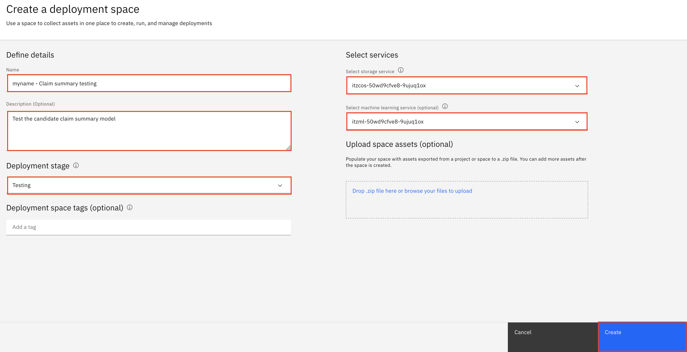

4. When the space has been created, click **Close** to return to the list of spaces.

You have successfully created a deployment space.

### Promote the model to the space

1. In the IBM watsonx platform, click on the **Navigation Menu** in the upper left to expand it. Locate the **Projects** section of the menu, expanding it if necessary, and click on **View all projects**.

  

2. Select your **generative** AI project that you created in **lab 103** (ex. `<your initials or unique string> - Auto claim summary`).

  

3. Click on the **Assets** tab of the project. From the list of assets, locate the **Insurance claim summarization** entry and click on the three dots to the right to expand the context menu. Click on **Promote to space** from the menu.

  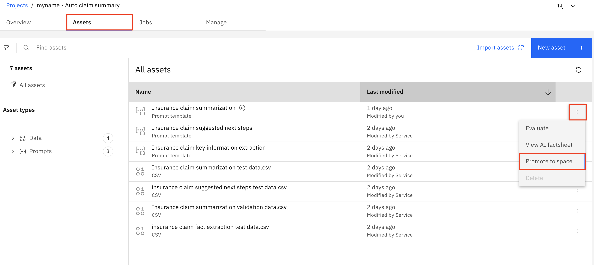

4. Click on the **Target space** dropdown, and click on the space you created in the previous step. Check the box to the left of **Go to the space after promoting the prompt template**. Click the **Promote** button.

  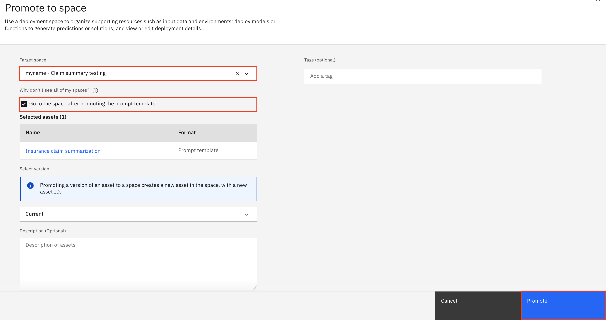

You have successfully promoted the **generative** AI model to the deployment space.

### Create a deployment

The model has been promoted to the space, but cannot be accessed by application developers until it has been deployed. Deployment spaces can contain different types of assets, including the models themselves, as well as data used in batch processing jobs. Spaces are also fully governed, allowing administrators to provide different levels of access for different stakeholders.

1. Click the **New deployment** button.

2. Give your deployed model a name that includes some identifying information and the purpose it will be used for (ex. `<your initials or unique string> - Claim summarization`). Click the **Create** button.

  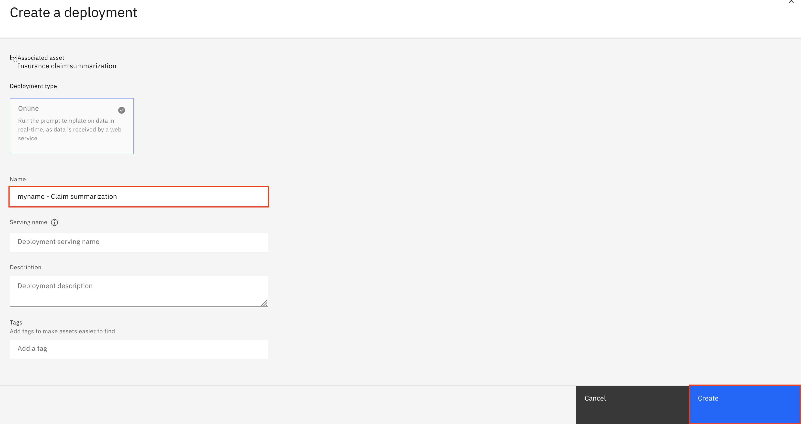

  When the deployment is finished, the **Status** in the displayed table will change to **Deployed**.

You have successfully created a deployment.

### View the deployment details and lifecycle changes

1. Click on the new deployment from the list of deployments.

  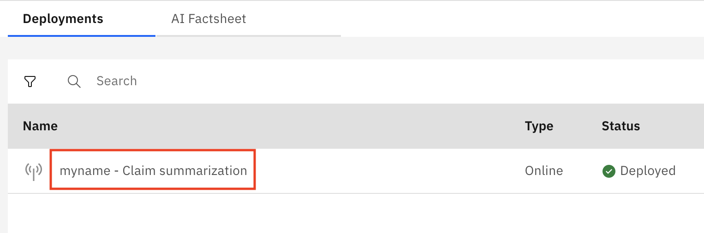

  Note that the **API reference** tab contains useful information for application developers looking to integrate the model into their apps, including code snippets and endpoint links.

2. Click on the **AI Factsheet** tab. Note that the tab shows that the model has progressed to the **Validate** stage of the model lifecycle.

  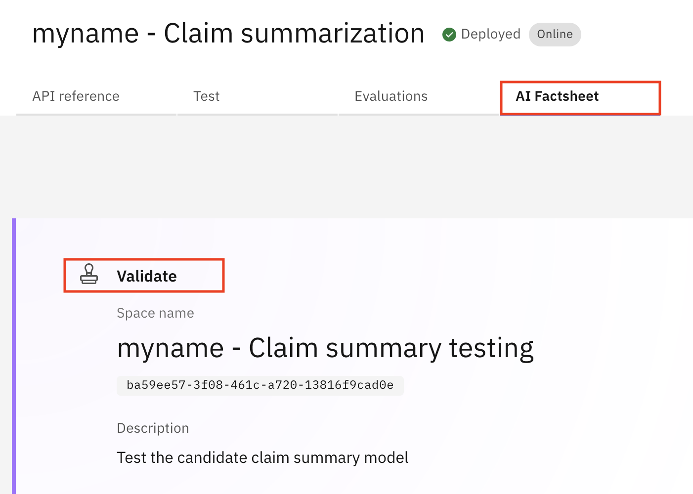

3. Click on the **Navigation Menu** in the upper left to expand it. Locate the **AI governance** section of the menu, expanding it if necessary, and click on **AI use cases**.

  

4. Select the AI use case you created in **lab 102** (ex. `<your initials or unique string> - Claim summarization`) and click on the **Lifecycle** tab to view the lifecycle graph for this model's use case, which will reflect the same progress on the **AI Factsheet**. Note that there is now an entry for the model in the **Validate** section of the model lifecycle view, with a badge showing that an evaluation is pending.

  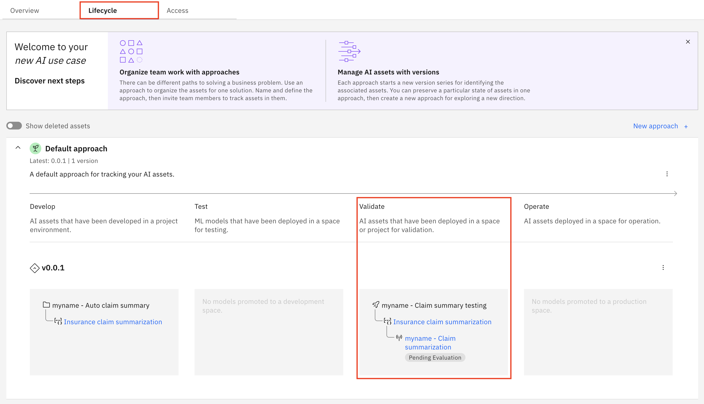

You have successfully viewed the deployment details for your new deployment and progressed the **generative** AI model to the **Validate** stage of the model lifecycle.

### Congratulations, you've reached the end of lab 105 for deploying a **generative** AI model.

Click, [lab 106](/watsonx/watsonxgov/106) to start next lab.

## Deploy a **predictive** AI model

In this lab, you will promote a **predictive** AI model to a deployment space and deploy it. Watsonx uses deployment spaces to organize models and model-related assets for validation and production access. Deploying the model allows it to be accessed via REST API for further testing.

### Create a deployment space and promote the model to the space

1. In the IBM watsonx platform, click on the **Navigation Menu** in the upper left to expand it. Locate the **Projects** section of the menu, expanding it if necessary, and click on **View all projects**.

  

2. Select your **predictive** AI project that you created in **lab 103** (ex. `<your initials or unique string> - Auto policy risk`).

  

3. Click on the **Assets** tab of the project. From the list of assets, locate and click on the **AutoAI policy risk - P4 Ridge - Model** entry to open the model information screen.

  

4. Click the **Promote to deployment space** button.

5. Click on the **Target space** dropdown, then click on **Create a new deployment space** option from the list. The **Create a deployment space** window will open.

  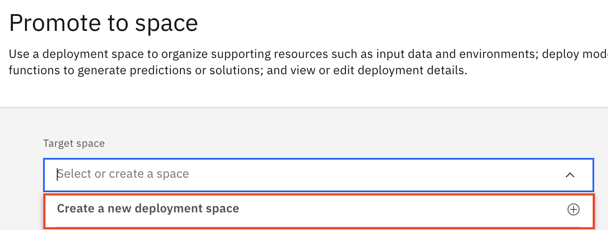

3. In the **Create a deployment space** window fill out the information below and then press the **Create** button:

  - **Name:** Give your deployment space a name that includes some identifying information, the purpose it will be used for and include "testing" to denote this as a space for testing (ex. `<your initials or unique string> - Policy risk testing`).
  - **Description:** `Test the candidate policy risk model`
  - **Deployment stage:** From the dropdown, click on **Testing** from the list. Designating the deployment stage will ensure that the models deployed in this space will appear in the correct phase of the lifecycle map in the AI use case.
  - **Select storage service:** Ensure that the **Select storage service** dropdown is correctly set to the object storage service you are using for this lab.
  - **Select machine learning service:** Ensure that the **Select machine learning service** dropdown is correctly set to the machine learning service you are using for this lab.

  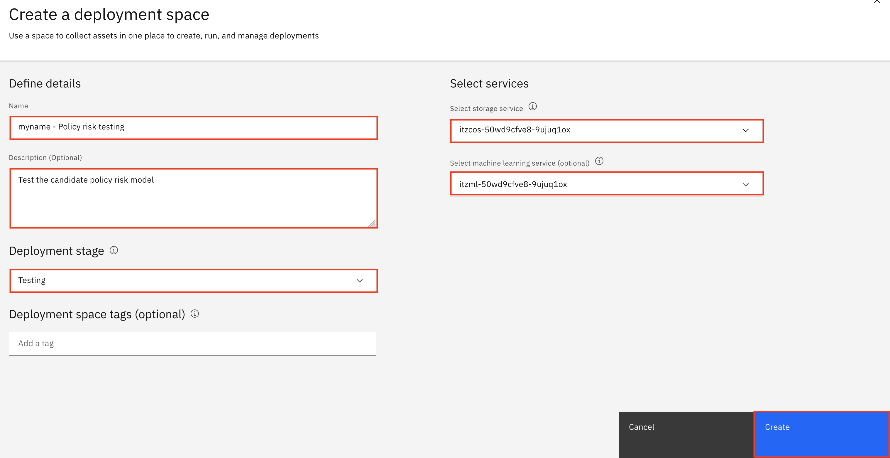

4. When the space has been created, click **Close** to return to the **Promote to space** window.

5. Check the box to the left of **Go to the space after promoting the prompt template**. Click the **Promote** button.

  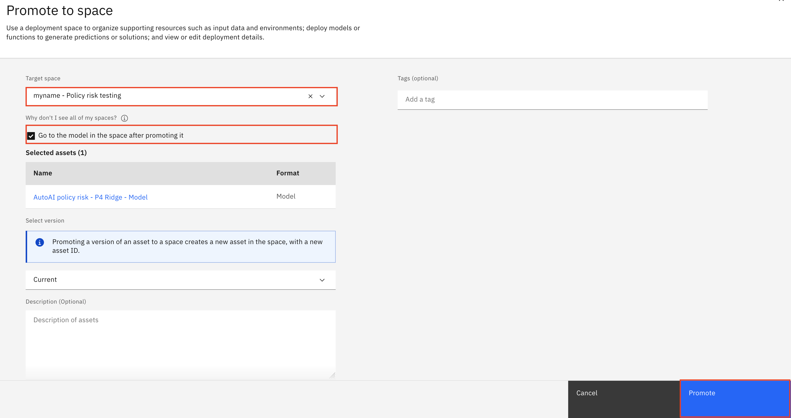

You have successfully created a deployment space and promoted the **predictive** AI model to the deployment space.

### Create a deployment

The model has been promoted to the space, but cannot be accessed by application developers until it has been deployed. Deployment spaces can contain different types of assets, including the models themselves, as well as data used in batch processing jobs. Spaces are also fully governed, allowing administrators to provide different levels of access for different stakeholders.

1. Click the **New deployment** button.

2. Ensure that the **Online** tile is selected. This deployment type will allow for REST API access. Give your deployed model a name that includes some identifying information and the purpose it will be used for (ex. `<your initials or unique string> - Policy risk testing`). Click the **Create** button.

  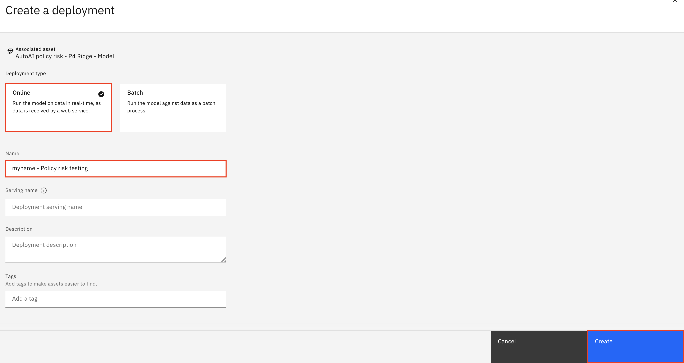

  When the deployment is finished, the **Status** in the displayed table will change to **Deployed**.

You have successfully created a deployment.

### View the deployment details and lifecycle changes

1. Click on the new deployment from the list of deployments.

  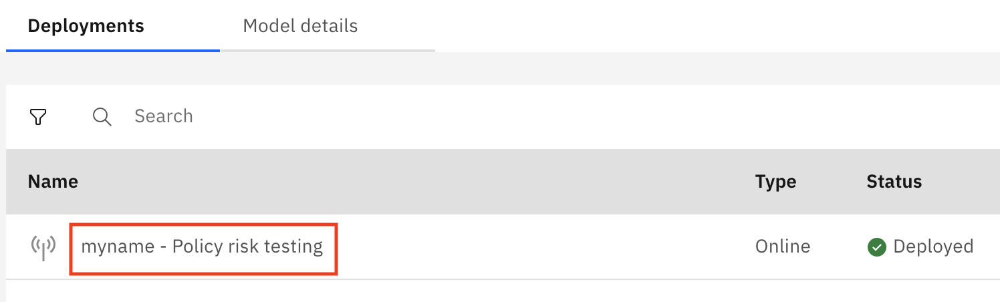

  Note the details provided on the **API Reference** tab include direct URLs to the model, as well as code snippets in a variety of programming languages that allow application developers to seamlessly include the model in their apps. The **Test** tab allows for direct testing of the model using either uploaded CSV files or JSON input.

2. Click on the **Deployment details** tab. Note that, in the **Track this model** section of the screen, the model tracking has carried over from the tracking established in the project. Click on the **Open in AI use case** button.

  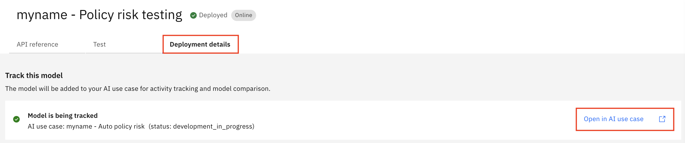

3. Click on the **Lifecycle** tab to view the lifecycle graph for this model's use case. Note that there is now an entry for the model in the **Test** section of the model lifecycle view, with a badge showing that an evaluation is pending. In this stage, the model connection can be tested by application developers as well as the data science teams to ensure that it's functioning properly and accessible. The next step will be to validate that the model is making fair, accurate decisions.

  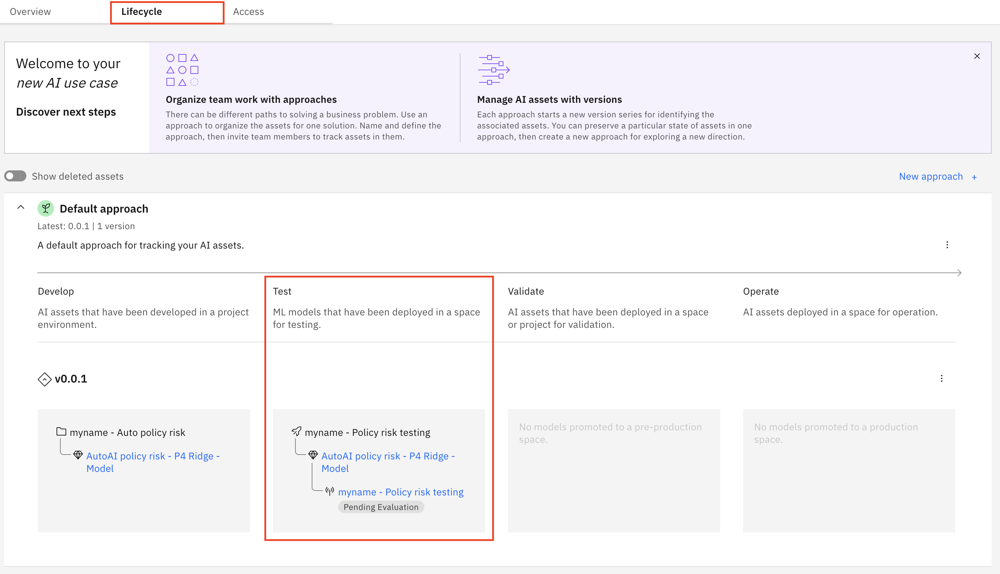

You have successfully viewed the deployment details for your new deployment and progressed the **predicitve** AI model to the **Test** stage of the model lifecycle.

### Congratulations, you've reached the end of lab 105 for deploying a **predictive** AI model.

Click, [lab 106](/watsonx/watsonxgov/106) to start next lab.
