# Gestión de activos de IA con versiones

## Gestión de activos de IA con versiones para modelos **generativos** de IA

En este laboratorio, configurará el seguimiento de modelos utilizando un nuevo enfoque y versión para gobernar y gestionar activos de IA con modelos **generativos** de IA entrenados para resumir reclamaciones de seguros.

### Requisitos previos

Completa los siguientes laboratorios L3 de watsonx.governance para un modelo **generativo** de IA:

*   **[Módulo 102: Definir un caso de uso de un modelo de IA](/watsonx/watsonxgov/102)**
*   **[Módulo 103: Configurar un proyecto IBM watsonx.ai](/watsonx/watsonxgov/103)**
*   **[Módulo 104: Seguimiento de un modelo de IA](/watsonx/watsonxgov/104)**

### Caso práctico

Para este caso de uso, el departamento de reclamaciones de automóviles de la gran compañía de seguros quiere utilizar un modelo de IA generativa para resumir las reclamaciones de seguros de automóviles, lo que creen que reducirá significativamente la carga de trabajo de su departamento de revisión de reclamaciones y mejorará el tiempo de respuesta de las reclamaciones. Han estado probando el uso de un modelo de IA generativa, pero creen que este modelo de fundación concreto no está generando los detalles necesarios en los resúmenes y ha llegado el momento de probar un nuevo enfoque y modelo de fundación para resolver sus dudas antes de empezar a utilizar el modelo en producción.

### Crear nueva plantilla de aviso

1.  En la plataforma IBM watsonx, haga clic en el **Menú de navegación** de la parte superior izquierda para expandirlo. Localice la sección **Proyectos** del menú, ampliándola si es necesario, y haga clic en **Ver todos los proyectos**.

2.  Seleccione el proyecto de IA **generativa** que creó en **el laboratorio 103** (por ejemplo, `<tus iniciales o cadena única> - Auto claim summary`).

1.  Haga clic en la pestaña **Activos** del proyecto. En la lista de activos, seleccione la entrada **Resumen de siniestros de seguros**.

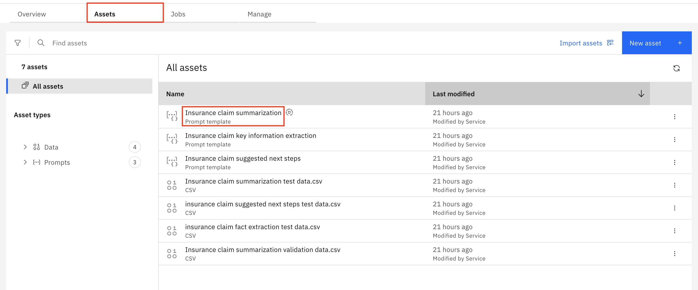

4.  En la esquina superior derecha, pulse el botón **TXT** para ver el texto completo que se está utilizando para esta plantilla.

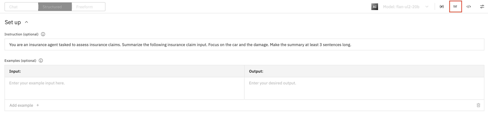

5.  Pulse el botón **Generar** para generar una salida a partir de la entrada del texto de resumen completo. Observe los detalles generados para el resumen en el output. Esta plantilla utiliza el modelo de fundación **flan-ul2-20b**. Comparará este resultado de output con la versión que se creará con un modelo de fundación diferente.

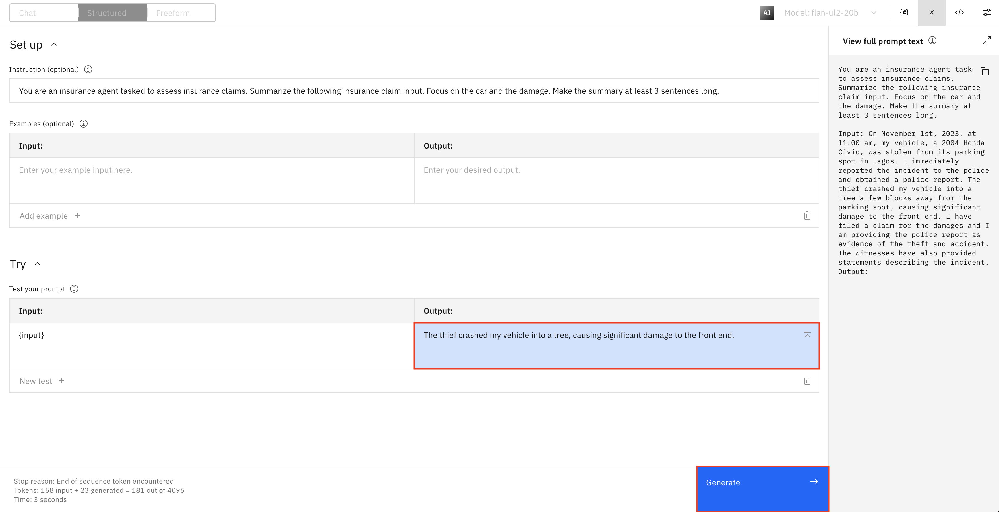

6.  Selecciona el icono **Guardar** disquete en la parte superior y pulsa **Guardar como**.

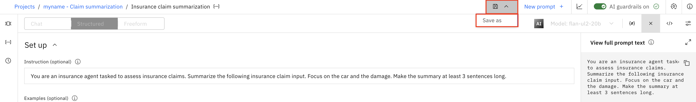

7.  En la ventana **Guarde su trabajo**, rellene la siguiente información y, a continuación, pulse el botón **Guardar**:

*   **Tipo de activo:** Plantilla de consulta
*   **Nombre:** `New insurance claim summarization`
*   **Tarea:** Resumir
*   **Ver en el proyecto después de guardar:** Asegúrese de que la opción **Ver** en el proyecto después de guardar está seleccionada

8.  Seleccione de la lista de activos la nueva plantilla de aviso de **resumen de siniestro de seguro**. Se abrirá una ventana emergente **Editar esta plantilla de prompt** . Seleccione **Editar**.
9.  En la esquina superior derecha, pulse el botón **Modelo: flan-ul2-20b** y, a continuación, seleccione **Ver todos los modelos de fundación** para cambiar el modelo utilizado para esta nueva versión.

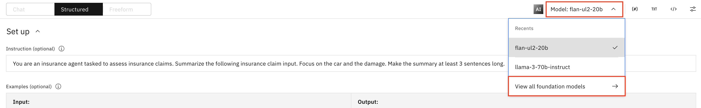

10. En la lista de modelos de fundación, seleccione el modelo **llama-3-70b-instruct** y, a continuación, pulse el botón **Seleccionar modelo**.

> Nota: Si utilizas watsonx.ai on-prem, es posible que veas diferentes modelos compatibles con tus GPU.

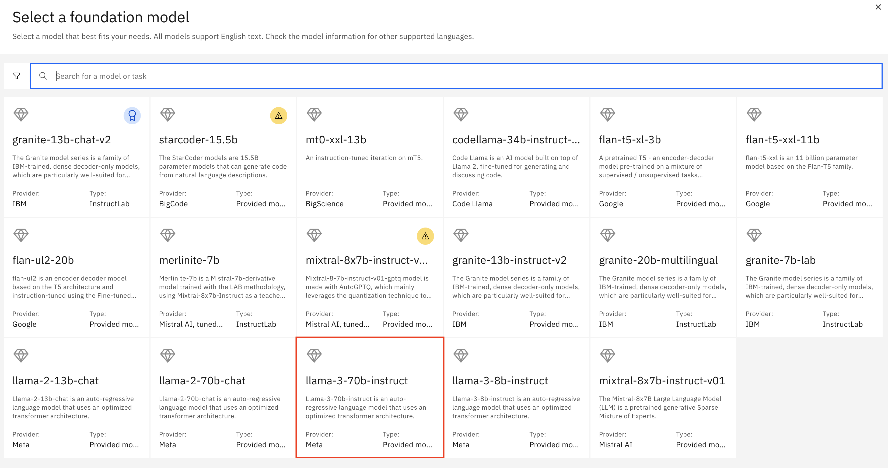

11. Repita **los pasos 4 y 5** para generar el output de esta versión utilizando el nuevo modelo **llama-3-70b-instruct**. Compare el output resultante con el output de la versión original utilizando el modelo **flan-ul2-20b**. Observe cómo esta nueva versión que utiliza el modelo de fundación **llama-3-70b-instruct** genera un resumen más detallado en el output. Esto está más en línea con lo que el departamento de reclamaciones de automóviles de la gran compañía de seguros estaba buscando para resumir las reclamaciones de seguros de automóviles.

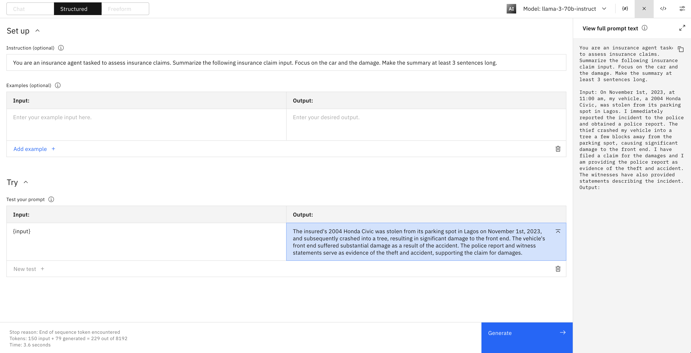

Ha creado con éxito una nueva versión de una plantilla de solicitud utilizando un modelo de fundación diferente.

### Configurar el seguimiento de modelos

1.  Haga clic en el icono **Información** situado en la esquina superior derecha y haga clic en **Ver hoja informativa** en la sección **Acerca de esta plantilla de consulta**.

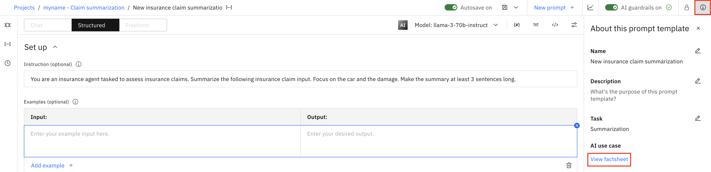

2.  En la sección **"Gobernanza"** de la **ficha sobre IA**, haga clic en el botón " **Seguimiento de la IA** ".

3.  Haga clic en el botón de opción situado a la izquierda del caso de uso de IA que creó en **el laboratorio 102** (por ejemplo, `<tus iniciales o cadena única> - Claim summarization`). Haga clic en **Siguiente**.

1.  Cuando se le pida que **Defina el enfoque**, pulse el botón **Nuevo enfoque** y asigne al nuevo enfoque el nombre `Llama approach`, después pulse **Crear**. Confirme que el enfoque recién creado está seleccionado y pulse **Siguiente**.

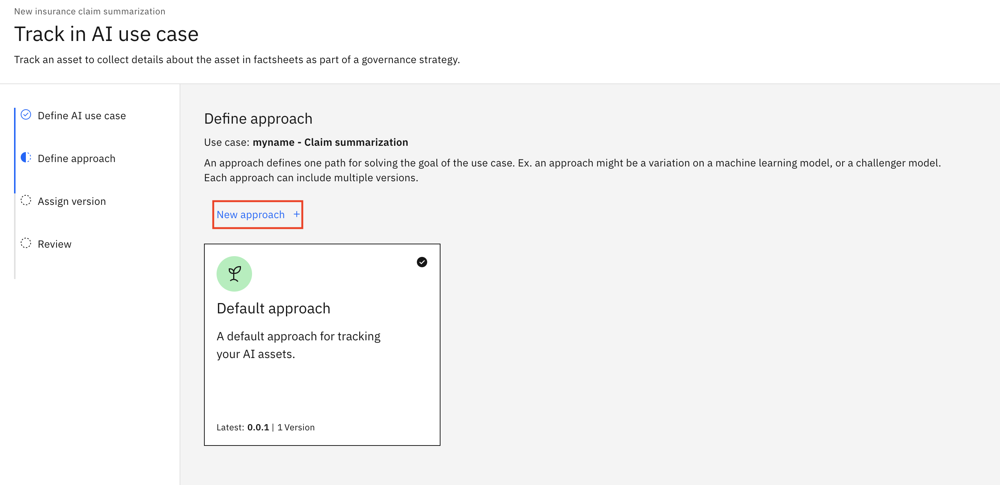

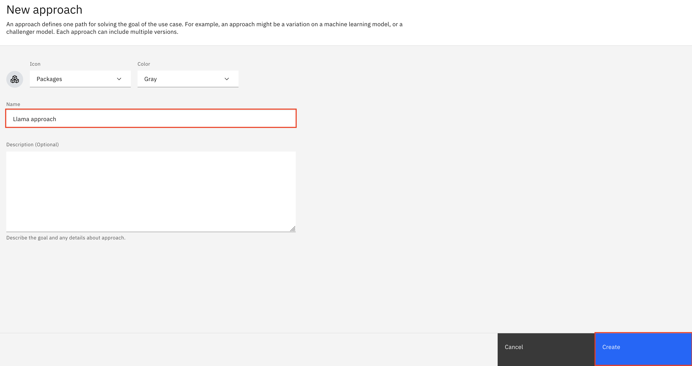

5.  Cuando se le pida que asigne una versión del modelo, seleccione **Personalizada** e ingrese `0.0.2` para el **número de Versión**, después haga clic en **Siguiente**. Tenga en cuenta que aquí puede asignar manualmente un número de versión, o elegir un número de versión más apto para producción en función del estado del modelo. Haga clic en **Seguimiento de activos** para iniciar el seguimiento del modelo.
6.  Tenga en cuenta que la sección **Gobernanza** de la **ficha de datos de IA** contiene ahora información sobre el caso de uso de IA asociado, el enfoque utilizado, la versión del modelo y la fase del ciclo de vida (**Desarrollo**).

Ha configurado correctamente el seguimiento de modelos para un modelo de IA **generativa** utilizando un nuevo enfoque y versión.

### Ver el caso de uso de IA actualizado con el modelo rastreado

1.  En la esquina superior derecha de la sección **Gobernanza** de la **ficha de datos** de IA, haga clic en la flecha **Ver detalles** para acceder al caso de uso de IA asociado.

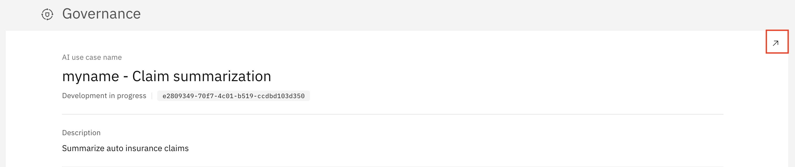

1.  Haga clic en la pestaña **Ciclo de vida** y, a continuación, desplácese hacia abajo hasta el mapa de modelos contenidos en las secciones **Llama approach**  y **enfoque Predeterminado**. Observe que la nueva versión del modelo aparece en el **Llama approach**, mientras que el modelo original sigue apareciendo en el **enfoque Predeterminado**.

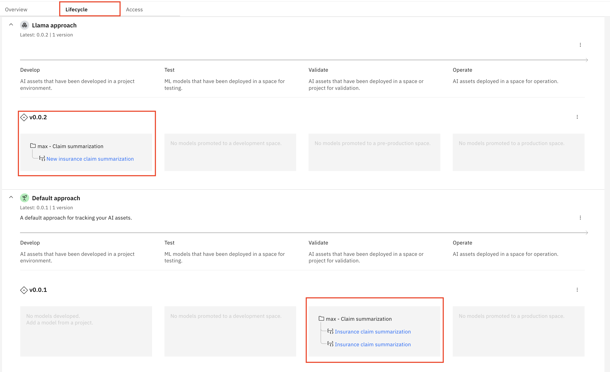

> **Nota:** la pestaña **Ciclo de vida** del **caso de uso de IA** es útil para que las partes interesadas y los usuarios empresariales obtengan una visión general rápida de todos los modelos que intentan abordar un problema concreto, con la posibilidad de profundizar para obtener más información según sea necesario, todo ello sin necesidad de acceder al proyecto en el que trabajan los desarrolladores y los ingenieros de datos.

Ha habilitado con éxito el seguimiento del modelo utilizando un nuevo enfoque y versión, y ahora puede observar los cambios a medida que el modelo atraviesa el ciclo de vida.

### Enhorabuena, has llegado al final del laboratorio 107 para la gestión de activos de IA con versiones.
